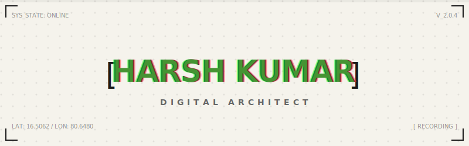

<div align="center">
  


<p align="center">
  <i>An ultra-premium, brutalist-inspired interactive developer portfolio.</i>
</p>

<p align="center">
  <a href="https://vercel.com/new/clone?repository-url=https://github.com/Harshkumar2306/My-Portfolio">
    
  </a>
</p>

<p align="center">
  
  
  
  
</p>

<p align="center">
  <b><a href="https://harsh-kumar-blush.vercel.app/">[ ⬢ LIVE DEMO ]</a></b> &nbsp;•&nbsp;
  <b><a href="https://github.com/Harshkumar2306/My-Portfolio/issues">[ 🐛 REPORT BUG ]</a></b> &nbsp;•&nbsp;
  <b><a href="https://github.com/Harshkumar2306/My-Portfolio/issues">[ ✨ REQUEST FEATURE ]</a></b>
</p>

</div>

---

## ✦ The Vision

Designed to break away from the standard, infinite-scrolling website structure. This portfolio utilizes a **fixed-height horizontal slider architecture**, providing a highly engaging, presentation-like experience across all devices. It is built to feel like an interactive editorial magazine rather than a traditional web page.

## ✦ Key Features

### 🖥️ Horizontal Slider Architecture
- **Presentation-Style Navigation:** Replaces vertical scrolling with a fixed-height, horizontal sliding interface powered by Framer Motion.
- **Keyboard & Click Support:** Navigate seamlessly using `ArrowLeft` / `ArrowRight` keys, or the floating chevron buttons.
- **Deep Linking:** Supports query parameters (e.g., `?section=2`) to link directly to specific slides.

### 🏛️ Editorial & Brutalist UI/UX
- **Custom Design System:** Built *without* Tailwind. Relies on a highly optimized vanilla CSS variables architecture (`globals.css`) for maximum granular control.
- **Micro-interactions:** Fluid hover states on all interactive elements, dynamic map rendering, and smooth, staggered page transitions.
- **Strict Grid Alignments:** Perfect, mathematical grid alignments and sharp `0px` border-radius components for a premium, technical aesthetic.
- **Glitch & CRT Effects:** Futuristic text treatments and subtle grid backgrounds to reinforce the "Digital Architect" theme.

### 📱 Advanced Adaptive Engine
- **Context-Aware Scaling:** Dynamically switches from a strict "Full-Screen Lock" on desktop to an "Internal Scroll" model on mobile phones, utilizing modern `100dvh` constraints.
- **Fluid Typography & Spacing:** Uses CSS `clamp()` to mathematically scale massive headers and section gaps perfectly to any viewport width.
- **5-Tier Breakpoints:** Custom responsive behaviors engineered for Ultrawide, Desktop, Tablet, standard Mobile, and compact devices.

---

## ✦ Technology Stack

- **Framework:** Next.js 14 (App Router)
- **Language:** TypeScript
- **Animation:** Framer Motion
- **Styling:** Vanilla CSS (CSS Variables, Flexbox, CSS Grid)
- **Icons:** React Icons
- **Data Visualization:** React Simple Maps
- **Deployment:** Vercel

---

## ✦ Local Development

### Prerequisites
- Node.js 18+
- Git

### 1. Clone & Install
```bash
git clone https://github.com/Harshkumar2306/My-Portfolio.git
cd My-Portfolio
npm install
```
*(Note: If you run into peer dependency issues with `react-simple-maps`, the repo includes an `.npmrc` file configured to `legacy-peer-deps=true`)*

### 2. Run Development Server
```bash
npm run dev
```
The portfolio will be available at [http://localhost:3000](http://localhost:3000).

### 3. Build for Production
```bash
npm run build
npm start
```

---

## ✦ Project Architecture

```text
My-Portfolio/
├── src/
│   ├── app/
│   │   ├── layout.tsx            # Root layout and metadata configuration
│   │   ├── page.tsx              # Main slider logic, state, and UI components
│   │   └── globals.css           # Core design system & CSS variables
│   ├── components/
│   │   ├── IndiaMap.tsx          # Custom SVG map configuration
│   │   └── IndiaMapComponent.tsx # Map wrapper and interactivity
├── public/                       # Static assets
├── tsconfig.json                 # Strict TypeScript configuration
└── next.config.mjs               # Next.js bundler settings
```

---

## ✦ License & Usage

Feel free to fork this repository if you want to study the horizontal slider architecture for your own projects!

If you find this project helpful or inspiring, please consider leaving a ⭐️ on the repository!

<div align="center">
  <br>
  Built with obsession to detail by <b>Harsh Kumar</b>
</div>
